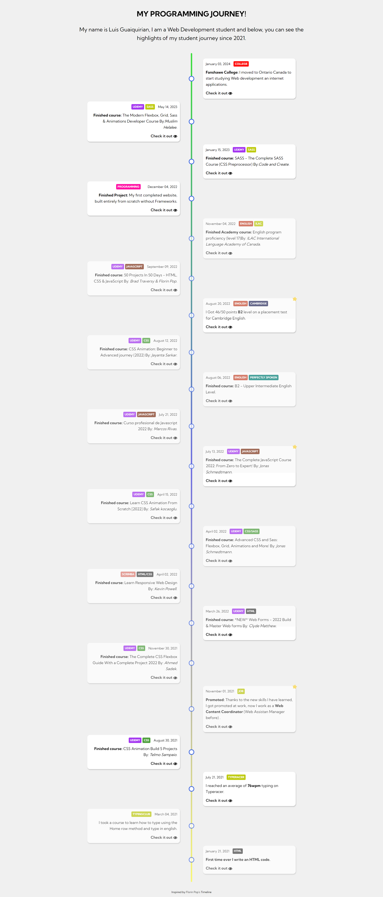
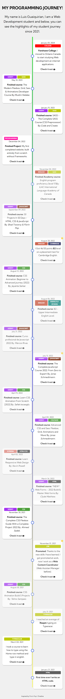

# Luis Guaiquirian

## 📜 Timeline Journey 📜

Responsive Timeline where I share my journey as a student since 2021.
https://myjourney-timeline.netlify.app/

## 👨‍💻 Used Technologies 👨‍💻

| Technology | Description                                                                     |
| ---------- | ------------------------------------------------------------------------------- |
| HTML       | Basic structure.                                                                |
| CSS        | Style and animations.                                                           |
| JavaScript | Mainly used for the animation of containers visibles according to the viewport. |

## 🤗 Social Network 🤗

- 🧑‍💻 GitHub: https://github.com/luisgcode 🧑‍💻
- 🧑‍💻 LinkedIn: https://www.linkedin.com/in/luisgcode/ 🧑‍💻
- 🧑‍💻 Instagram: https://www.instagram.com/luisgcode/ 🧑‍💻

## 📜 Screenshots 📜

